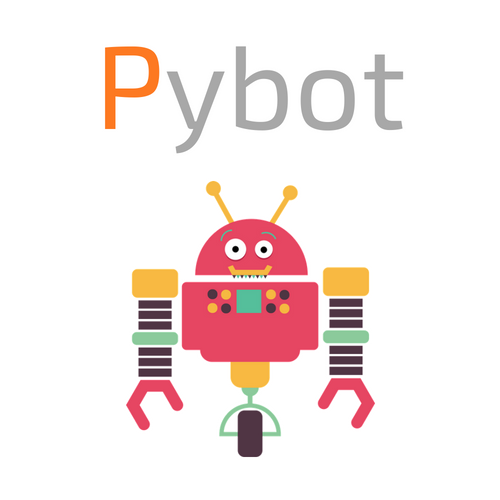
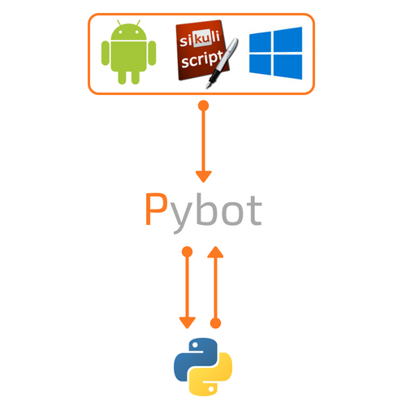

This automation framework aims to interact with GUI (web, desktop, android, etc) from the computer, or a connected Android. Many tasks 
could be automated, like information harvesting or tests. Script can be designed with Sikuli IDE. The framework then convert 
Sikuli project to python 3 to take advantage of that powerful scripting language and the python 3 ecosystem.



## Platforms
  At the moment, for computer, only Windows platforms are supported. Android can be accessed by mirroring the phone screen
  thanks to [scrpy](https://github.com/Genymobile/scrcpy) embedded in this framework.
  
## Why another framework
  Sikuli IDE is an extremely powerful tool to script automation through any GUI, web browser, android, etc... The only python3 
  compliant wrapper around Sikuli is lackey. This then use lackey and other libraries to complete the laking features of Sikuli.
  Unlike pure Sikuli that use JVM and therefore Jython to access some low level API, this framework access platform API via
  robust python method. For instance, using real python allow us to pytest. Other methods are available from the Pybot 
  class to easily extract information from the GUI like text by used Tesseract OCR. 

## Dependencies
  [Python 3.6](https://www.python.org/downloads/) with virtualenv to create the virtual env. The all purpose of this framework 
  is to use to possibility to script GUI elements with [Sikuli IDE](http://www.sikuli.org/downloadrc3.html) to initiate scripts
  and class. Sikuli is java based, therefore you need [Java](https://www.java.com/fr/download/). To analyse image text, this framework
  needs [Tesseract OCR](https://github.com/tesseract-ocr/tesseract), for the python wrapper to work the tesseract command
  has to be in the path. It should be something like ```C:\Program Files (x86)\Tesseract-OCR```.
  
### Pip packages
  The pip package lackey (the only python3 Sikuli wrapper) , virtualenv, pytest, pytest-html, doxypypy, lackey, isort, autopep8,
  wheel, easygui and pytesseract pip packages. Sikuli method are named like built-in or classical python method like ```type()```.
  lackey renamed the original method an ```_```, ```type()``` becomes ```type_()```. For the same reason it also depend on the 
  pip package virtualenv, cause it is highly recommended to run this library out of classical python.

## Use
  Download from this git repository and create the virtulenv:
  ```cmd
  git clone https://github.com/phe-sto/Pybot.git
  cd Pybot
  Pybot setup
  ```
  Export Sikuli class from your sikuli project in the ```sikuli_project/``` folder:
  ```cmd
  Pybot export class <your project name>
  ```
  Export Sikuli script from your sikuli project in the ```sikuli_project/``` folder:
  ```cmd
  Pybot export script <your project name>
  ```
  Scripts and classes are available in the venv virtualenv. To activate this one:
  ```cmd
  Pybot activtate
  ```
  Clear the virtualenv:
  ```cmd
  Pybot clear
  ```
  Deactivate the virtualenv:
  ```cmd
  deactivate
  ```
  delete the virtualenv:
  ```cmd
  Pybot clear
  ```
  
## Contact
  https://PapIT.fr or christophe.brun@papit.fr